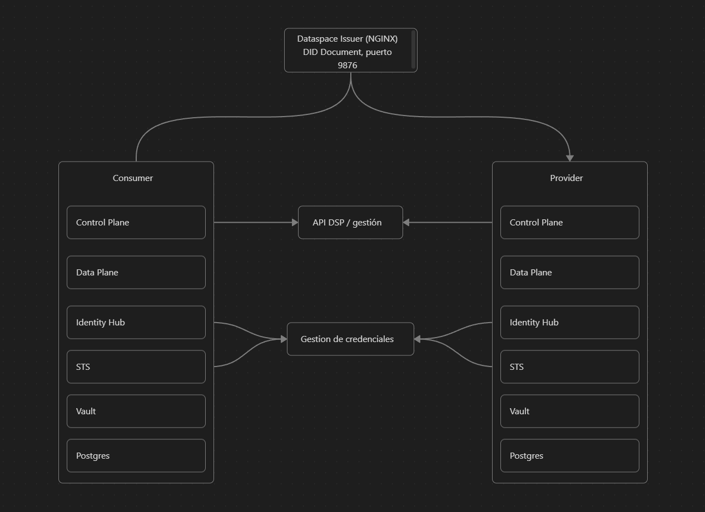

# Visión técnica del Minimum Viable Dataspace

Este documento ofrece una visión rápida de la arquitectura del Minimum Viable Dataspace (MVD), de los servicios que se despliegan, los puertos por defecto, las dependencias necesarias y los pasos recomendados para ejecutarlo. Sirve como guía operativa complementaria al [README principal](../README.md).

## 1. Arquitectura general


El escenario contempla dos participantes (Consumidor y Proveedor) conectados a un “dataspace issuer” que publica el DID raíz de la federación. Cada participante empaqueta los siguientes servicios:

- Control Plane de EDC: API para gestionar contratos y catálogos.
- Data Plane de EDC: Gestión de la transferencia y exposición de datos.
- Identity Hub: Identity Hub: Gestiona los DIDs y credenciales Verificables (VCs).
- Secure Token Service (STS): Servicio independiente (en Kubernetes) o embebido en el Control Plane en modo IntelliJ.
- Hashicorp Vault (dev): Almacén de claves y secretos.
- PostgreSQL: Base de datos persistente para contratos, transferencias e identidad.
- Catalog Server: Servicio para consultar el catálogo de activos (en lugar de un HTTP server).



## 2. Servicios y puertos

| Servicio / componente | Puertos por defecto (demo local)                | Descripción |
|-----------------------|-----------------------------------------------|-------------|
| Control plane         | Consumidor 8080–8085 · Proveedor 8080–8085    | APIs `/api/management/v3`, `/api/control/v1`, `/api/catalog/v1`: contratos y catálogos. |
| Data plane            | Consumidor 8180 (web) / 8183 (control) · Proveedor 8180 / 8183 | Transferencias de datos y API pública `/api/public`. |
| Identity Hub          | Consumidor 7080–7084 · Proveedor 7090–7094    | Gestión de credenciales, DID document y STS embebido. |
| Secure Token Service  | Consumidor 8480–8482 · Proveedor 8580–8582    | Emisión de tokens OAuth2 para los conectores. |
| Vault (modo dev)      | Consumidor 8300 · Proveedor 8200               | Almacena claves privadas y secretos de configuración. |
| Postgres (control)    | Consumidor 5433 · Proveedor 5435               | Persistencia de contratos, assets y transferencias. |
| Postgres (identidad)  | Consumidor 5434 · Proveedor 5436               | Persistencia del Identity Hub. |
| HTTP server           | 8888                                          | API REST con los datos de ejemplo. |

| Dataspace issuer      | 9876                                          | NGINX que publica el DID raíz alojado en `deployment/assets/issuer`. |

Nota: si se ejecutan las imágenes en contenedores, los puertos internos pueden mapearse a otros externos según el `docker-compose` que utilices.

Todas las APIs protegidas usan la clave `password` como `Authorization: Bearer password` o encabezado `x-api-key: password` (coherente con los `.env`).

## 3. Dependencias necesarias

### Desarrollo local / demo IntelliJ
- JDK 17 o superior.
- Gradle wrapper (incluido en el repositorio).
- Docker Desktop o Docker Engine (para NGINX, Vault, Postgres y contenedores completos).
- Node.js + npm y Newman (`npm install -g newman`) para ejecutar el script de seeding.
- IntelliJ IDEA (o VS Code) con soporte Gradle.

### Despliegue en Kubernetes
- Docker o Podman para generar imágenes.
- kind y kubectl.
- Terraform CLI (los módulos viven en `deployment/modules`).
- Registro de contenedores si vas a publicar imágenes personalizadas.

## 4. Pasos de despliegue

### 4.1 Demo local con IntelliJ
1. Importa el proyecto en IntelliJ y deja que Gradle resuelva dependencias.
2. Arranca el dataspace issuer (NGINX) para servir el DID raíz:
   ```bash
   docker run -d --name mvd-nginx -p 9876:80 --rm \
     -v "$PWD"/deployment/assets/issuer/nginx.conf:/etc/nginx/nginx.conf:ro \
     -v "$PWD"/deployment/assets/issuer/did.docker.json:/var/www/.well-known/did.json:ro \
     nginx:1.27.5
   ```
3. Ejecuta los launchers `consumer-*` y `provider-*` (control plane, data plane, identity hub, STS, http server). Existe una configuración compuesta `dataspace` que los lanza en orden.
4. Compila las imágenes (opcional) si quieres reutilizarlas en Docker/Kubernetes:
   ```bash
   ./gradlew build
   ./gradlew -Ppersistence=true dockerize
   ```
5. Ejecuta el seeding (requiere Newman):
   ```bash
   ./seed.sh
   ```
6. Comprueba el estado:
   ```bash
   curl http://localhost:8081/api/check/health                     # control plane consumidor
   curl http://localhost:8081/api/management/v3/assets \
     -H "Authorization: Bearer password"
   ```

### 4.2 Ejecución con imágenes Docker generadas localmente
1. Genera las imágenes como en el punto anterior (`./gradlew build` + `./gradlew -Ppersistence=true dockerize`).
2. Define un `docker-compose.yml` para cada participante usando las imágenes `controlplane:latest`, `dataplane:latest`, `identity-hub:latest`, así como contenedores de Vault y Postgres (ver ejemplo en el documento).
3. Lanza el compose (`docker compose up -d`) y, cuando los servicios estén en estado saludable, ejecuta `./seed.sh` apuntando a los endpoints expuestos.

### 4.3 Despliegue en Kubernetes
1. Construye las imágenes (`./gradlew build` y `./gradlew -Ppersistence=true dockerize`).
2. Crea un clúster KIND e instala un ingress NGINX:
   ```bash
   kind create cluster --config deployment/kind/kind-config.yaml --name mvd
   kubectl apply -f https://raw.githubusercontent.com/kubernetes/ingress-nginx/main/deploy/static/provider/kind/deploy.yaml
   kubectl wait --namespace ingress-nginx --for=condition=ready pod --selector=app.kubernetes.io/component=controller --timeout=120s
   ```
3. Carga las imágenes en KIND y aplica los módulos Terraform de `deployment/modules`:
   ```bash
   kind load docker-image controlplane:latest dataplane:latest identity-hub:latest catalog-server:latest -n mvd
   cd deployment/modules
   terraform init
   terraform apply
   ```
4. Ejecuta el seeding (`../seed.sh`) apuntando a los hostnames/puertos publicados por el ingress.

## 5. Checklist operativo

- Health checks: `GET /api/check/health` en cada control plane, data plane e identity hub.
- Management API: `POST /api/management/v3/assets` con `Authorization: Bearer password`.
- Catálogo: `GET /api/catalog/v1/items` (mismo token).
- DSP callbacks: comprueba que `edc.dsp.callback.address` resuelve desde ambos participantes (ajusta IP si ejecutas en Docker Desktop o K8s).
- Vault: token dev `root`; secretos del STS en `secret/<did>-sts-client-secret`.
- Seeding: ejecutar `seed.sh` cada vez que arranques desde una base limpia para poblar DIDs, credenciales y assets.

## 6. Referencias útiles

- Guía detallada: [README](../README.md)
- Script de seeding: [`seed.sh`](../seed.sh)
- Colección Postman y entorno HTTP Client: [`deployment/postman`](../deployment/postman)
- Configuración de los launchers que generan las imágenes: [`EDC-Connector/launchers`](../../EDC-Connector/launchers)
